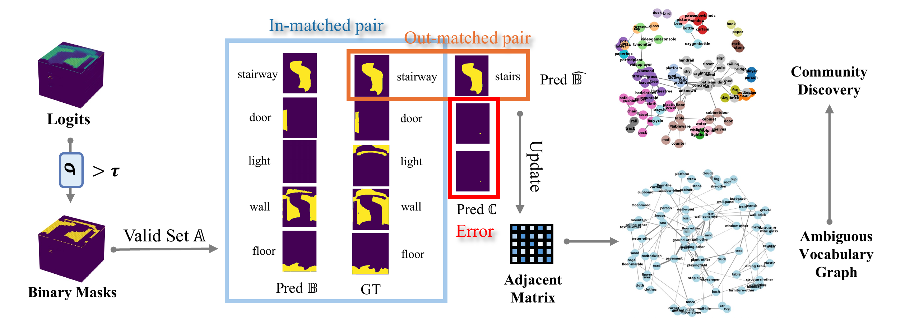

# Revisit the Open Nature of Open Vocabulary Semantic Segmentation [ICLR2025]

Qiming Huang, Han Hu, Jianbo Jiao

<a href='https://mix.jianbojiao.com/'> Machine Intelligence + *x* (MI*x*), School of Computer Science, University of Birmingham. </a> Our group mainly studies machine learning and computer vision, and also interested in other applied machine learning problems including multimodal data, neuroscience, healthcare, physics, chemistry, to name a few. That is where the x lies in.

<a href='https://qiming-huang.github.io/RevisitOVS/'></a> <a href=''></a> 



In Open Vocabulary Semantic Segmentation (OVS), we observe a consistent drop in model performance as the query vocabulary set expands, especially when it includes semantically similar and ambiguous vocabularies, such as ‘sofa’ and ‘couch’. The previous OVS evaluation protocol, however, does not account for such ambiguity, as any mismatch between model-predicted and human-annotated pairs is simply treated as incorrect on a pixel-wise basis. This contradicts the open nature of OVS, where ambiguous categories may both be correct from an open-world perspective.

To address this, in this work, we study the open nature of OVS and propose a mask-wise evaluation protocol that is based on matched and mismatched mask pairs between prediction and annotation respectively. Extensive experimental evaluations show that the proposed mask-wise protocol provides a more effective and reliable evaluation framework for OVS models compared to the previous pixel-wise approach on the perspective of the open world. Moreover, analysis of mismatched mask pairs reveals that a large number of ambiguous categories exist in commonly used OVS datasets.

Interestingly, we find that reducing these ambiguities during both training and inference enhances the capabilities of OVS models. These findings and the new evaluation protocol encourage further exploration of the open nature of OVS, as well as broader open-world challenges.

## Mask-wise Evaluation Method
We follow the evaluation methodology of the [detectron2](https://github.com/facebookresearch/detectron2) codebase. In addition, we have also integrated the code of Open-IoU and SG-IoU.

Our example code is based on the [CAT-Seg](https://github.com/cvlab-kaist/CAT-Seg) model code. We would like to express our gratitude for their contribution.

The evaluation codes are listed below:

```bash
├── cat_seg
      ├── evaluation
      │   ├── __init__.py
      ├   ├── cp_iou.py
      │   ├── open_iou.py
      │   └── sg_iou.py
```

## Usage
Simply change the evaluation method in `train_net.py`

```python
class Trainer(DefaultTrainer):
    """
    Extension of the Trainer class adapted to DETR.
    """

    @classmethod
    def build_evaluator(cls, cfg, dataset_name, output_folder=None):
        if output_folder is None:
            output_folder = os.path.join(cfg.OUTPUT_DIR, "inference")
        evaluator_list = []
        evaluator_type = MetadataCatalog.get(dataset_name).evaluator_type
        if evaluator_type in ["sem_seg", "ade20k_panoptic_seg"]:
            evaluator_list.append(
                CP_IoU(
                    dataset_name,
                    distributed=True,
                    output_dir=output_folder,
                )
            )
```

## Citation
If you find our work useful in your research, please consider citing:
```
@inproceedings{huangrevisit,
        title={Revisit the open nature of open vocabulary segmentation},
        author={Huang, Qiming and Hu, Han and Jiao, Jianbo},
        booktitle={The Thirteenth International Conference on Learning Representations}}
```
